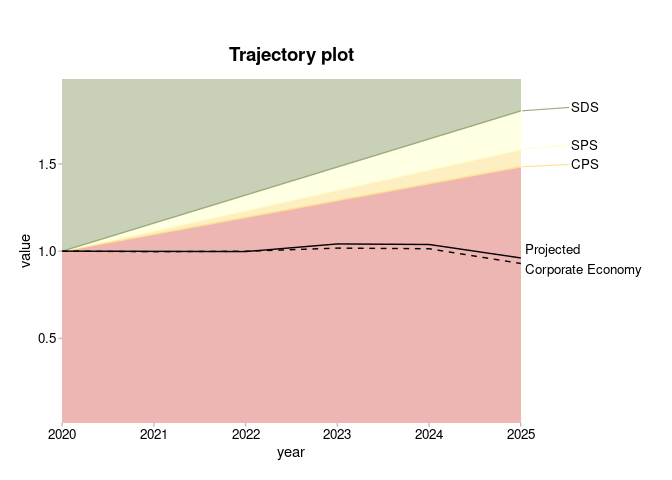
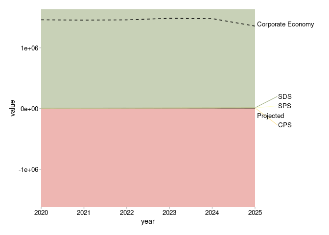

<!-- README.md is generated from README.Rmd. Please edit that file -->

# r2dii.plot <a href='https://github.com/2DegreesInvesting/r2dii.plot'></a>

<!-- badges: start -->

[](https://lifecycle.r-lib.org/articles/stages.html)
[](https://codecov.io/gh/2DegreesInvesting/r2dii.plot?branch=master)
[](https://github.com/2DegreesInvesting/r2dii.plot/actions)
<!-- badges: end -->

The goal of r2dii.plot is to help you plot 2DII data in an informative,
beautiful, and easy way.

## Installation

You can install the development version of r2dii.plot from
[GitHub](https://github.com/2DegreesInvesting/r2dii.plot) with:

``` r
# install.packages("devtools")
devtools::install_github("2DegreesInvesting/r2dii.plot")
```

## Example

The r2dii.plot package is designed to work smoothly with other “r2dii”
packages –
[r2dii.data](https://2degreesinvesting.github.io/r2dii.data/),
[r2dii.match](https://2degreesinvesting.github.io/r2dii.match/), and
[r2dii.analysis](https://2degreesinvesting.github.io/r2dii.analysis/).
It also plays well with the popular packages
[dplyr](https://www.tidyverse.org/) and
[ggplot2](https://ggplot2.tidyverse.org/), which help you prepare your
data and customize your plots.

``` r
library(dplyr, warn.conflicts = FALSE)
library(ggplot2, warn.conflicts = FALSE)
library(r2dii.plot)
```

Your data typically comes from the output of two functions in the
r2dii.analysis package:
[`target_sda()`](https://2degreesinvesting.github.io/r2dii.analysis/reference/target_sda.html)
and
[`target_market_share()`](https://2degreesinvesting.github.io/r2dii.analysis/reference/target_market_share.html).
Here you’ll use two example datasets that come with r2dii.plot.

``` r
sda
#> # A tibble: 208 x 4
#>    sector      year emission_factor_metric emission_factor_value
#>    <chr>      <dbl> <chr>                                  <dbl>
#>  1 automotive  2002 projected                              0.228
#>  2 automotive  2003 projected                              0.226
#>  3 automotive  2004 projected                              0.224
#>  4 automotive  2005 projected                              0.222
#>  5 automotive  2006 projected                              0.220
#>  6 automotive  2007 projected                              0.218
#>  7 automotive  2008 projected                              0.216
#>  8 automotive  2009 projected                              0.214
#>  9 automotive  2010 projected                              0.212
#> 10 automotive  2011 projected                              0.210
#> # … with 198 more rows

market_share
#> # A tibble: 1,170 x 8
#>    sector     technology  year region scenario_source metric          production
#>    <chr>      <chr>      <int> <chr>  <chr>           <chr>                <dbl>
#>  1 automotive electric    2020 global demo_2020       projected          145942.
#>  2 automotive electric    2020 global demo_2020       corporate_econ…   8134869.
#>  3 automotive electric    2020 global demo_2020       target_cps         145942.
#>  4 automotive electric    2020 global demo_2020       target_sds         145942.
#>  5 automotive electric    2020 global demo_2020       target_sps         145942.
#>  6 automotive electric    2021 global demo_2020       projected          148212.
#>  7 automotive electric    2021 global demo_2020       corporate_econ…   8183411.
#>  8 automotive electric    2021 global demo_2020       target_cps         148361.
#>  9 automotive electric    2021 global demo_2020       target_sds         160625.
#> 10 automotive electric    2021 global demo_2020       target_sps         149016.
#> # … with 1,160 more rows, and 1 more variable: technology_share <dbl>
```

r2dii.plot supports three kinds of plots – timeline, techmix, and
trajectory.

### Timeline

Use `plot_timeline()` with `sda`-like data. You’ll need to pick the
specific rows you want to plot. For details see the documented
“Requirements” of the argument `data`, or try intuitively and let the
error messages guide you.

``` r
plot_timeline(sda)
#> Error: `sda` must have a single value of `sector` but has: automotive, aviation, cement, oil and gas, shipping, coal, steel.
#> Pick one value, e.g. 'automotive', with:
#>   dplyr::filter(sda, sector == 'automotive')
```

The error message suggests you must first pick only one value of
`sector`, for example “cement”.

``` r
sda %>% 
  filter(sector == "cement") %>% 
  plot_timeline()
```


Great! You can now polish your plot. Your options are limitless but
these are some typical things you may do:

-   Pick a narrower time range.
-   Extrapolate the timeline.
-   Add a title.

``` r
data <- filter(sda, sector == "cement", year >= 2020)

plot_timeline(data, extrapolate = TRUE) + 
  labs(title = "Timeline plot")
```


You can further customize your plot by adding a custom manual scale
using `ggplot` function `scale_colour_manual()` with custom legend
labels.

``` r
data <- filter(sda, sector == "cement")

plot_timeline(data, extrapolate = TRUE) +
  scale_color_manual(
    values = c("#4a5e54", "#a63d57", "#78c4d6", "#f2e06e"),
    labels = c("Proj.", "Corp. Economy", "Target (demo)", "Adj. Scenario (demo)")
  )
#> Scale for 'colour' is already present. Adding another scale for 'colour',
#> which will replace the existing scale.
```


### Techmix

Use `plot_techmix()` with `market_share`-like data. Again, learn which
rows to pick by reading the documented “Requirements” of the argument
`data`, or by trial and error.

``` r
unique(market_share$metric)
#> [1] "projected"         "corporate_economy" "target_cps"       
#> [4] "target_sds"        "target_sps"
chosen_metrics <- c("projected", "corporate_economy", "target_sds")

data <- market_share %>%
  filter(
    metric %in% chosen_metrics,
    sector == "power",
    region == "global"
  )

plot_techmix(data) + 
  labs(title = "Techmix plot")
```


You may customize the plot further by:

-   Setting custom colours and colour labels, using
    `ggplot2::scale_color_manual()`.
-   Picking the range of years to plot, by filtering the data passed to
    `plot_techmix()` (instead of the full range by default).

``` r
data <- market_share %>%
  filter(
    metric %in% chosen_metrics,
    sector == "power",
    region == "global",
    between(year, 2020, 2025)
  )

plot_techmix(data) + 
  scale_fill_manual(
    values = c("black", "brown", "grey", "blue", "green4"),
    labels = paste(c("Coal", "Oil", "Gas", "Hydro", "Renewables"), "Cap.")
  )
#> Scale for 'fill' is already present. Adding another scale for 'fill', which
#> will replace the existing scale.
```



### Trajectory

Use `plot_trajectory()` with `market_share`-like data. Again, learn
which rows to pick by reading the documented “Requirements” of the
argument `data`, or by trial and error.

``` r
data <- market_share %>% 
  filter(
    sector == "power", 
    region == "global", 
    technology == "renewablescap",
    year <= 2025
  )

plot_trajectory(data) + 
  labs(title = "Trajectory plot")
```


Use the `main_line` argument to indicate which trajectory line should be
most visually salient (solid black line) – it’s “projected” by default
but the next plot sets it explicitly for demonstration.

Use `normalize = FALSE` if you prefer not to normalize to the start
year.

``` r
plot_trajectory(data, main_line = "projected", normalize = FALSE)
```


