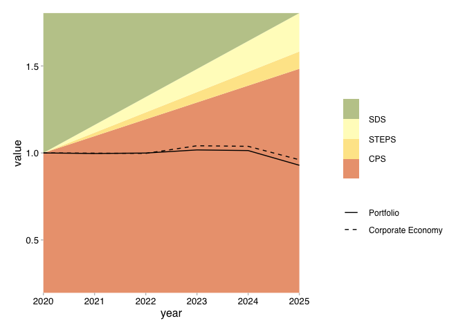

<!-- README.md is generated from README.Rmd. Please edit that file -->

# r2dii.plot.static <a href='https://github.com/2DegreesInvesting/r2dii.plot.static'></a>

<!-- badges: start -->

[](https://lifecycle.r-lib.org/articles/stages.html)
[](https://codecov.io/gh/2DegreesInvesting/r2dii.plot.static?branch=master)
[](https://github.com/2DegreesInvesting/r2dii.plot.static/actions)
[](https://CRAN.R-project.org/package=r2dii.plot.static)
<!-- badges: end -->

The goal of r2dii.plot.static is to provide users with plotting and data
processing functions that will allow the users to create standard 2DII
plots using `PACTA_analysis` or banks’ output data as input. The plots
are in the form of ggplot objects.

## Installation

You can install the development version of r2dii.plot.static from
[GitHub](https://github.com/2DegreesInvesting/r2dii.plot.static) with:

``` r
# install.packages("devtools")
devtools::install_github("2DegreesInvesting/r2dii.plot.static")
```

[How to minimize installation
errors?](https://gist.github.com/maurolepore/a0187be9d40aee95a43f20a85f4caed6#installation)

## Example

``` r
library(tidyverse)
#> ── Attaching packages ─────────────────────────────────────── tidyverse 1.3.0 ──
#> ✓ ggplot2 3.3.3     ✓ purrr   0.3.4
#> ✓ tibble  3.1.0     ✓ dplyr   1.0.5
#> ✓ tidyr   1.1.3     ✓ stringr 1.4.0
#> ✓ readr   1.4.0     ✓ forcats 0.5.1
#> ── Conflicts ────────────────────────────────────────── tidyverse_conflicts() ──
#> x dplyr::filter() masks stats::filter()
#> x dplyr::lag()    masks stats::lag()
library(r2dii.plot.static)
```

-   `example_data` imports example data set for plotting.
-   `process_input_data()` performs the initial processing on raw input
    data in banks’ format.

``` r
example_data <- process_input_data(example_data)
```

-   `plot_trajectory()` create a trajectory alignment chart in a ggplot
    object.

``` r
data_trajectory <- prepare_for_trajectory_chart(
  example_data,
  sector_filter = "power",
  technology_filter = "renewablescap",
  region_filter = "global",
  scenario_source_filter = "demo_2020",
  value_name = "production",
  end_year_filter = 2025,
  normalize_to_start_year = TRUE
)

scenario_specs <- tibble(
  scenario = c("sds", "sps", "cps", "worse"),
  color = c("#9CAB7C", "#FFFFCC", "#FDE291", "#E07B73"),
  label = c("SDS", "STEPS", "CPS", "worse")
)

main_line_metric <- tibble(
  metric = "projected",
  label = "Portfolio"
)

additional_line_metrics <- tibble(
  metric = "corporate_economy",
  label = "Corporate Economy"
)

plot_trajectory(
  data_trajectory,
  scenario_specs_good_to_bad = scenario_specs,
  main_line_metric = main_line_metric,
  additional_line_metrics = additional_line_metrics
) +
  labs(
    title = "Production trajectory",
    subtitle = "Renewables Capacity technology in the Power, sector",
    x = "Year",
    y = "Production rate (normalized to 2020)"
  )
#> Warning: partial match of 'height' to 'heights'
#> Warning: partial match of 'width' to 'widths'
```



-   `prepare_for_techmix_chart()` prepares pre-processed data for
    plotting a tech-mix chart.
-   `get_r2dii_technology_colours()` get the predefined technology
    colors for a sector.
-   `plot_techmix()` create a techmix chart in a ggplot object.

``` r
data_techmix_power <- prepare_for_techmix_chart(
  example_data,
  sector_filter = "power",
  years_filter = c(2020, 2025),
  region_filter = "global",
  scenario_source_filter = "demo_2020",
  scenario_filter = "sds",
  value_name = "technology_share"
)

tech_colors_power <- get_r2dii_technology_colours("power")
bars_labels_specs <- tibble(
  metric_type = c(
    "portfolio_2020",
    "benchmark_2020",
    "portfolio_2025",
    "benchmark_2025",
    "scenario_2025"
  ),
  label = c(
    "Portfolio 2020",
    "Benchmark 2020",
    "Portfolio 2025",
    "Benchmark 2025",
    "Target SDS 2025"
  )
)

plot_techmix(
  data_techmix_power,
  plot_title = "Technology mix for the Power sector",
  show_legend = TRUE,
  df_tech_colours = tech_colors_power,
  df_bar_specs = bars_labels_specs
)
```


``` r
power_colors_custom <- tibble(
  technology = c("coalcap", "oilcap", "gascap", "nuclearcap", "hydrocap", "renewablescap"),
  label = c("Coal Capacity", "Oil Capacity", "Gas Capacity", "Nuclear Capacity", "Hydro Capacity", "Renewables Capacity"),
  colour = c("black", "brown", "grey", "red", "blue", "green4")
)

plot_techmix(
  data_techmix_power,
  "Technology mix for the Power sector",
  show_legend = TRUE,
  df_tech_colours = power_colors_custom,
  df_bar_specs = bars_labels_specs
)
```


-   `prepare_for_timeline()` prepares sda\_target-type data for timeline
    plot.
-   `plot_timeline()` create a time line plot.

``` r
data_sda_cement <- prepare_for_timeline(
  sda_target,
  sector_filter = "cement",
  year_start = 2020,
  year_end = 2050,
  column_line_names = "emission_factor_metric",
  value_to_plot = "emission_factor_value",
  extrapolate_missing_values = TRUE
)

lines_specs <- tibble(
  line_name = c("projected", "corporate_economy", "target_demo", "adjusted_scenario_demo"),
  label = c("Projected", "Corporate Economy", "Target Demo", "Adjusted Scenario Demo"),
  r2dii_colour_name = c("dark_blue", "green", "grey", "orange")
)

plot_timeline(
  data_sda_cement,
  lines_specs = lines_specs
) +
  labs(
    title = "Emission intensity trend for Cement.",
    x = "Year",
    y = "Tons of CO2 per ton",
    caption = "Dashed line is an extrapolation of the last value in the dataset."
  )
```


