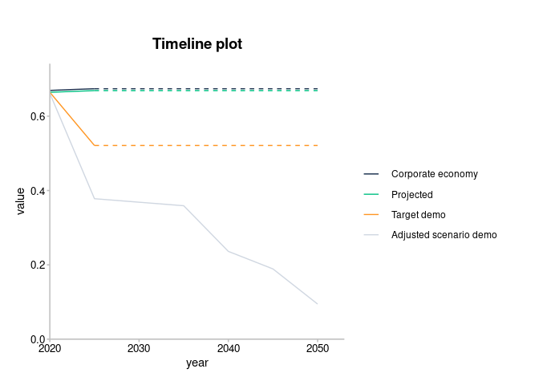
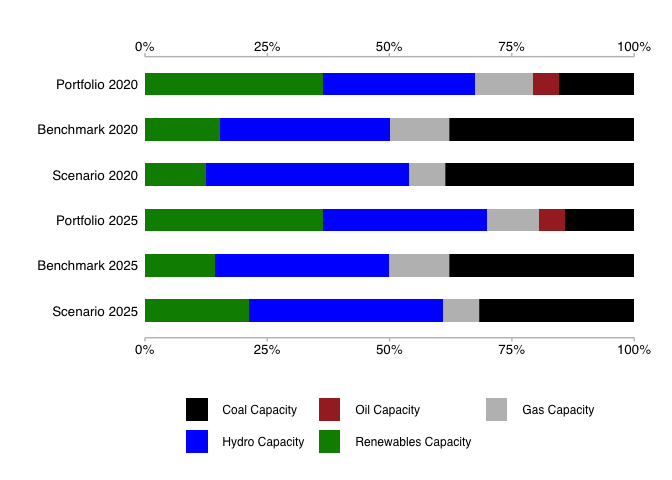
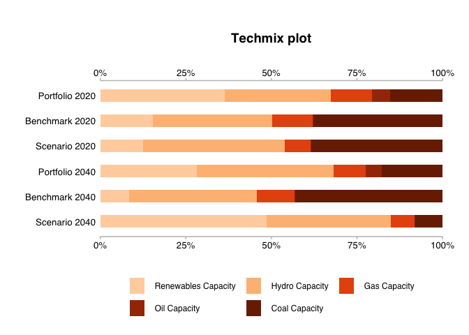
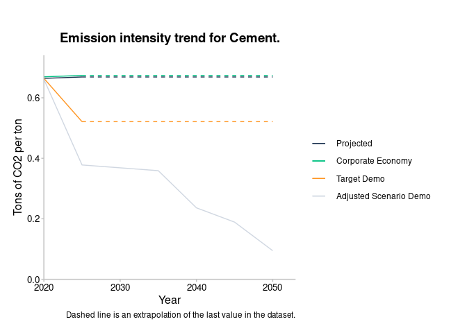
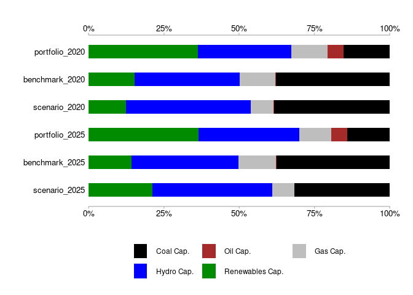

<!-- README.md is generated from README.Rmd. Please edit that file -->

# r2dii.plot <a href='https://github.com/2DegreesInvesting/r2dii.plot'></a>

<!-- badges: start -->

[](https://lifecycle.r-lib.org/articles/stages.html)
[](https://codecov.io/gh/2DegreesInvesting/r2dii.plot?branch=master)
[](https://github.com/2DegreesInvesting/r2dii.plot/actions)
[](https://CRAN.R-project.org/package=r2dii.plot)
<!-- badges: end -->

The goal of r2dii.plot is to provide users with plotting and data
processing functions that will allow the users to create standard 2DII
plots using `PACTA_analysis` or banks’ output data as input. The plots
are in the form of ggplot objects.

## Installation

You can install the development version of r2dii.plot from
[GitHub](https://github.com/2DegreesInvesting/r2dii.plot) with:

``` r
# install.packages("devtools")
devtools::install_github("2DegreesInvesting/r2dii.plot")
```

[How to minimize installation
errors?](https://gist.github.com/maurolepore/a0187be9d40aee95a43f20a85f4caed6#installation)

## Example

``` r
library(dplyr, warn.conflicts = FALSE)
library(ggplot2, warn.conflicts = FALSE)
library(r2dii.plot)
```

  - `market_share` dataset imitating the output of
    ‘r2dii.analysis::target\_market\_share()’.

<!-- end list -->

``` r
market_share
#> # A tibble: 1,170 x 8
#>    sector     technology  year region scenario_source metric          production
#>    <chr>      <chr>      <int> <chr>  <chr>           <chr>                <dbl>
#>  1 automotive electric    2020 global demo_2020       projected          145942.
#>  2 automotive electric    2020 global demo_2020       corporate_econ…   8134869.
#>  3 automotive electric    2020 global demo_2020       target_cps         145942.
#>  4 automotive electric    2020 global demo_2020       target_sds         145942.
#>  5 automotive electric    2020 global demo_2020       target_sps         145942.
#>  6 automotive electric    2021 global demo_2020       projected          148212.
#>  7 automotive electric    2021 global demo_2020       corporate_econ…   8183411.
#>  8 automotive electric    2021 global demo_2020       target_cps         148361.
#>  9 automotive electric    2021 global demo_2020       target_sds         160625.
#> 10 automotive electric    2021 global demo_2020       target_sps         149016.
#> # … with 1,160 more rows, and 1 more variable: technology_share <dbl>
```

  - `prep_trajectoryY()`: .

<!-- end list -->

``` r
data_trajectory <- prep_trajectoryY(
  market_share,
  sector_filter = "power",
  technology_filter = "oilcap",
  region_filter = "global",
  scenario_source_filter = "demo_2020",
  end_year_filter = 2025,
  normalize = TRUE
)
```

  - `plot_trajectoryY()` is an alternative to `plot_trajectoryB()`.

<!-- end list -->

``` r
# `plot_trajectoryY()` takes more arguments

scenario_specs <- tibble(
  scenario = c("sds", "sps", "cps"),
  label = c("SDS", "STEPS", "CPS")
)

main_line_metric <- tibble(
  metric = "projected",
  label = "Portfolio"
)

additional_line_metrics <- tibble(
  metric = "corporate_economy",
  label = "Corporate Economy"
)

plot_trajectoryY(
  data_trajectory,
  scenario_specs_good_to_bad = scenario_specs,
  main_line_metric = main_line_metric,
  additional_line_metrics = additional_line_metrics
)
```



``` r

# more elaborate annotations, title and labels

data_trajectory <- prep_trajectoryY(
  market_share, 
  sector_filter = "power",
  technology_filter = "renewablescap",
  region_filter = "global", 
  scenario_source_filter = "demo_2020",
  value = "production", 
  end_year_filter = 2025,
  normalize = TRUE
)

scenario_specs <- tibble(
  scenario = c("sds", "sps", "cps"),
  label = c(
    "Sustainable Development Scenario", 
    "Stated Policies Scenario", 
    "Current Policies Scenario")
)

plot <- plot_trajectoryY(data_trajectory,
  scenario_specs_good_to_bad = scenario_specs,
  main_line_metric = main_line_metric,
  additional_line_metrics = additional_line_metrics
)

plot +
  ggplot2::theme(
    plot.margin = ggplot2::unit(c(0.5, 7, 0.5, 0.5), "cm")
  ) +
  ggplot2::labs(
    title = "Production trajectory of Renewables Capacity technology\n in the Power sector",
    subtitle = "The coloured areas indicate trajectories in reference to a scenario.\n The red area indicates trajectories below any sustainble scenario.",
    x = "Year",
    y = "Production rate (normalized to 2020)"
  )
```



  - `prep_techmixY()` .
  - `plot_techmixY()` .

<!-- end list -->

``` r
# Default colours, all data, added title
sector <- "power"

data <- prep_techmixY(
  market_share,
  sector_filter = sector,
  years_filter = c(2020, 2025),
  region_filter = "global",
  scenario_source_filter = "demo_2020",
  scenario_filter = "sds",
  value = "technology_share"
)

plot <- plot_techmixY(data)
plot +
  ggplot2::labs(title = "Technology mix for the Power sector")
```



``` r

# Custom colours, all data, no title
power_colors_custom <- tibble(
  technology = c("coalcap", "oilcap", "gascap", "nuclearcap", "hydrocap", "renewablescap"),
  label = c("Coal Capacity", "Oil Capacity", "Gas Capacity", "Nuclear Capacity", "Hydro Capacity", "Renewables Capacity"),
  hex = palette.colors(n = length(technology), palette = "ggplot2")
)

plot <- plot_techmixY(data,
  tech_colours = power_colors_custom
)
plot
```



``` r

# Default colours, selected data and labels (metric_type parameters), added title

sector <- "automotive"

data <- prep_techmixY(market_share,
  sector_filter = sector,
  years_filter = c(2020, 2025), region_filter = "global",
  scenario_source_filter = "demo_2020",
  scenario_filter = "sds", value = "technology_share"
)

metric_type_order = c(
    "portfolio_2020", "benchmark_2020", "portfolio_2025",
    "benchmark_2025", "scenario_2025"
)
metric_type_labels = c(
    "Portfolio 2020", "Benchmark 2020", "Portfolio 2025",
    "Benchmark 2025", "Target SDS 2025"
  )

plot <- plot_techmixY(data,
  metric_type_order = metric_type_order,
  metric_type_labels = metric_type_labels
)
plot +
  ggplot2::labs(title = "Technology mix for the Automotive sector")
```


  - `prep_timelineY()` .
  - `plot_timelineY()` .

<!-- end list -->

``` r
data <- prep_timelineY(sda, sector_filter = "cement", extrapolate = TRUE)

# Plot and customize with ggplot2
plot_timelineY(data) +
  labs(
    title = "Emission intensity trend for Cement.",
    x = "Year",
    y = "Tons of CO2 per ton",
    caption = "Dashed line is an extrapolation of the last value in the dataset."
  )
```



  - `timeline_specs()` creates the default specs data frame for
    ‘plot\_timeliney()’.

<!-- end list -->

``` r
# You may use it as a template to create your custom specs
timeline_specs(data)
#> # A tibble: 4 x 3
#>   line_name              label                  hex    
#>   <chr>                  <chr>                  <chr>  
#> 1 projected              Projected              #1b324f
#> 2 corporate_economy      Corporate Economy      #00c082
#> 3 target_demo            Target Demo            #ff9623
#> 4 adjusted_scenario_demo Adjusted Scenario Demo #d0d7e1
```
