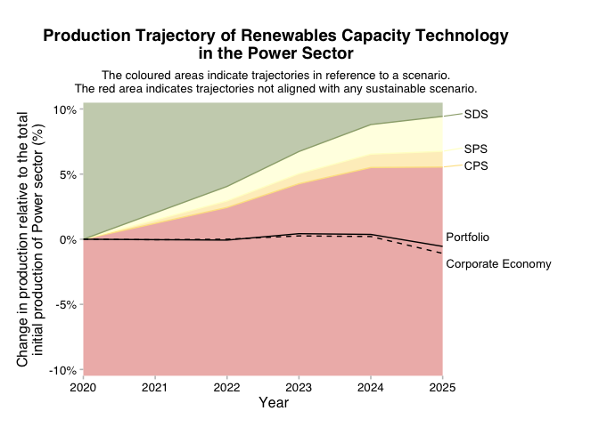

<!-- README.md is generated from README.Rmd. Please edit that file -->

# r2dii.plot 

<!-- badges: start -->

[](https://lifecycle.r-lib.org/articles/stages.html#stable)
[](https://app.codecov.io/gh/RMI-PACTA/r2dii.plot?branch=master)
[](https://CRAN.R-project.org/package=r2dii.plot)
[](https://github.com/RMI-PACTA/r2dii.plot/actions/workflows/R.yml)
<!-- badges: end -->

The goal of r2dii.plot is to help you plot PACTA data in an informative,
beautiful, and easy way.

## Installation

You can install the released version of r2dii.plot from CRAN with:

``` r
install.packages("r2dii.plot")
```

And the development version from GitHub with:

``` r
# install.packages("devtools")
devtools::install_github("RMI-PACTA/r2dii.plot")
```

## Example

The r2dii.plot package is designed to work smoothly with other “r2dii”
packages – [r2dii.data](https://rmi-pacta.github.io/r2dii.data/),
[r2dii.match](https://rmi-pacta.github.io/r2dii.match/), and
[r2dii.analysis](https://rmi-pacta.github.io/r2dii.analysis/). It also
plays well with the [ggplot2](https://ggplot2.tidyverse.org/) package,
which helps you customize your plots. Here, we’ll use an example data
set that comes with r2dii.plot and that resembles the output of the
[`target_market_share()`](https://rmi-pacta.github.io/r2dii.analysis/reference/target_market_share.html)
function in the r2dii.analysis package.

``` r
library(ggplot2, warn.conflicts = FALSE)
library(dplyr, warn.conflicts = FALSE)
library(r2dii.plot)
```

### Plot trajectory chart

- Use `qplot_*()` to quickly get a plot with standard titles and labels.

``` r
# `data` must meet documented "Requirements"
data <- market_share_demo %>%
  filter(
    sector == "power",
    technology == "renewablescap",
    region == "global",
    scenario_source == "demo_2020"
  )

qplot_trajectory(data)
```



- Use `plot_*()` for a more “bare” plot that you can customize yourself
  by modifying the input data and applying `ggplot2` functions.

``` r
data <- market_share_demo %>%
  filter(
    sector == "power",
    technology == "renewablescap",
    region == "global",
    scenario_source == "demo_2020",
    between(year, 2020, 2035)
  ) %>%
  mutate(
    label = case_when(
      metric == "projected" ~ "Your Portfolio",
      metric == "corporate_economy" ~ "Benchmark (Corp. Econ.)",
      metric == "target_sds" ~ "SDS Scenario",
      metric == "target_sps" ~ "SPS Scenario",
      metric == "target_cps" ~ "CPS Scenario",
      TRUE ~ metric
    )
  )

data %>%
  prep_trajectory() %>%
  plot_trajectory() +
  labs(
    title = "Power production trajectory for Renewables",
    subtitle = "With reference to climate scenarios.",
    x = "Year",
    y = "Production (normalized to 2020)"
  )
```


For examples of other plots and data sets please visit [Get started with
r2dii.plot](https://rmi-pacta.github.io/r2dii.plot/articles/r2dii-plot.html).

## Funding

This project has received funding from the [European Union LIFE
program](https://wayback.archive-it.org/12090/20210412123959/https://ec.europa.eu/easme/en/)
and the International Climate Initiative (IKI). The Federal Ministry for
the Environment, Nature Conservation and Nuclear Safety (BMU) supports
this initiative on the basis of a decision adopted by the German
Bundestag. The views expressed are the sole responsibility of the
authors and do not necessarily reflect the views of the funders. The
funders are not responsible for any use that may be made of the
information it contains.
